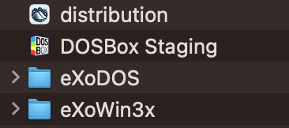
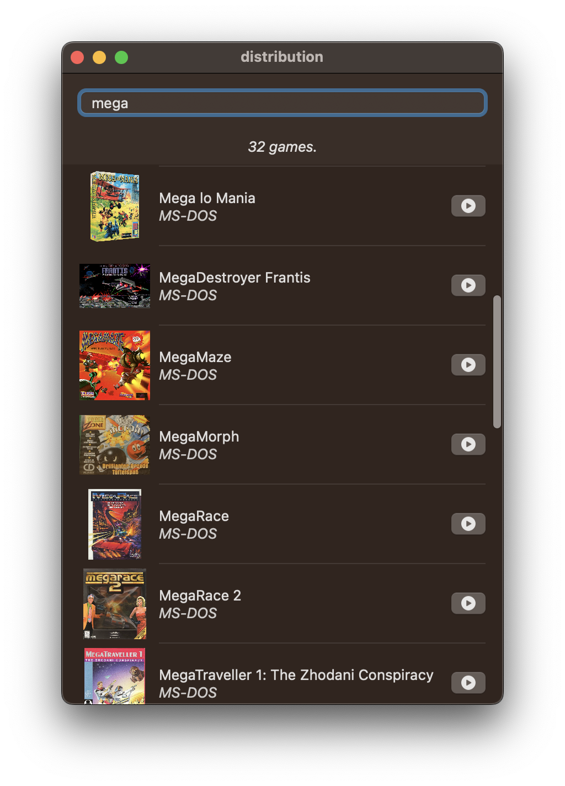

<p align="center">
  
</p>
<h2 align=center border=0>distribution</h2>

a few hours hack to launch eXoDOS/eXoWin3x games on macOS. there are no features.

assumes eXoDOS/eXoWin3x directories are present next to the .app and metadata zips extracted or setup .bats run. you're meant to just dump all of it onto an external drive.

likewise DOSBox Staging.app is assumed to be sitting next to this .app.



to extract the needed metadata you can do

```
(cd eXoDOS && unzip 'Content/!DOSmetadata.zip' && unzip Content/XODOSMetadata.zip)
(cd eXoWin3x && unzip 'Content/!Win3Xmetadata.zip' && unzip Content/XOWin3xMetadata.zip)
```

from the root

obligatory screenshot:


